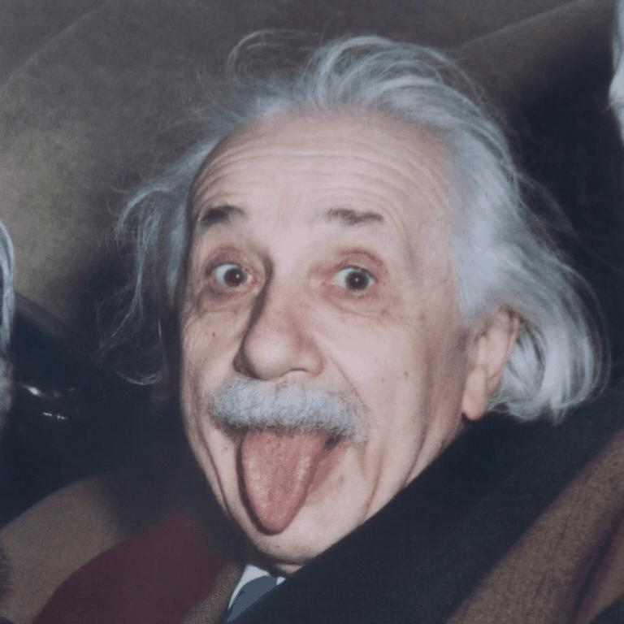
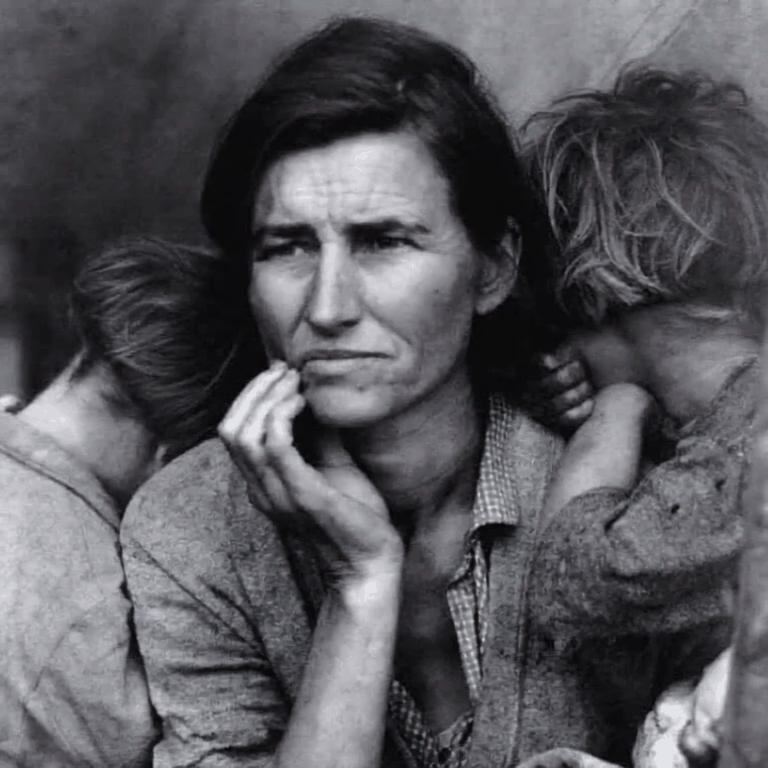
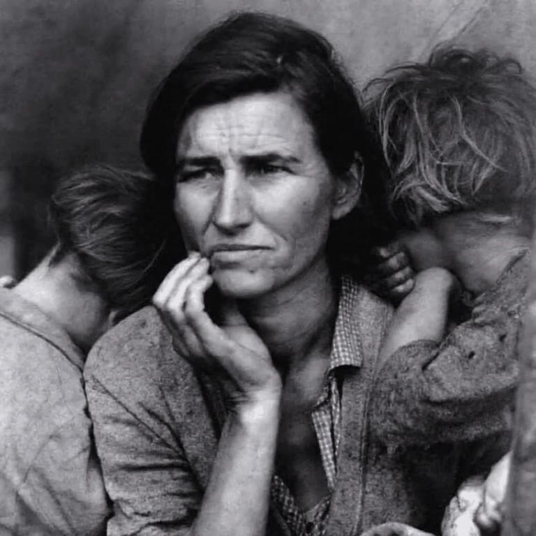
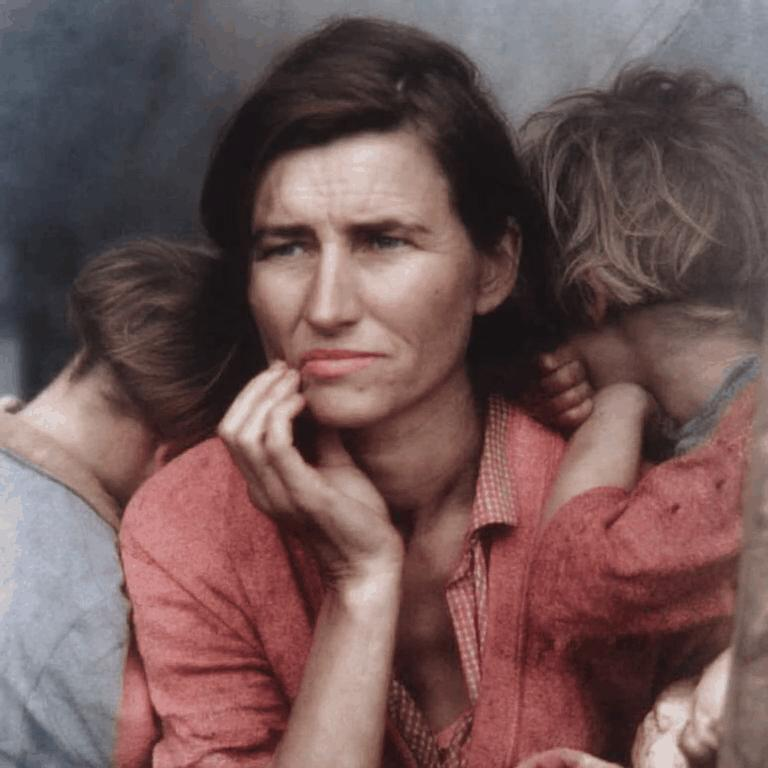

# Diffusion Colorization

*Bringing historical black-and-white photographs back to life with modern diffusion models*

---

## Overview

This repository demonstrates the power of diffusion models for intelligent image colorization. Using the same generative technology behind state-of-the-art image synthesis, our approach infers realistic and historically plausible color palettes for monochrome photographs.

The demonstrations below showcase dramatic before-and-after transformations, with animated GIFs revealing the progressive diffusion process that gradually builds up color information while preserving the original photograph's texture, lighting, and authenticity.

---

## Demonstration Gallery

### Einstein Portrait Colorization

  
  
  

  <strong>Before → Process → After</strong>

**Classic portrait transformation**: Albert Einstein's iconic black-and-white photograph is brought to life with natural skin tones, warm lighting, and period-appropriate colors that feel authentic to the original era.

---

### Migrant Mother - Blue Shirt Variant

  
  
  

  <strong>Before → Process → After</strong>

**Controlled colorization with text prompts**: By specifying *"blue shirt"* in the prompt, the model generates a plausible colorization while maintaining the photograph's emotional impact and historical authenticity. The system preserves the original's lighting, texture, and film grain.

---

### Migrant Mother - Red Shirt Variant

  
  
  

  <strong>Before → Process → After</strong>

**Demonstrating controllability**: The same photograph colorized with a *"red shirt"* prompt shows how our approach enables creative control while maintaining photographic realism. Each variant produces equally convincing results, showcasing the model's ability to generate multiple plausible colorizations.

---

## Key Features

- **Dramatic transformations**: Clear before-and-after comparisons showcase the power of diffusion-based colorization
- **Progressive diffusion process**: Animated GIFs reveal how color emerges step-by-step through the denoising process
- **Text-guided control**: Direct specific color choices through natural language prompts
- **Historical authenticity**: Colors that feel appropriate to the photograph's era and context
- **Texture preservation**: Original film grain, lighting, and photographic qualities remain intact
- **Multiple plausible outputs**: Generate different colorization variants for the same image

---

## Results Showcase

Our diffusion-based approach produces colorizations that feel natural and historically grounded, avoiding the artificial appearance often associated with traditional colorization methods. The side-by-side-by-side layout demonstrates both the dramatic impact of intelligent colorization and the sophisticated diffusion process that makes these transformations possible.
